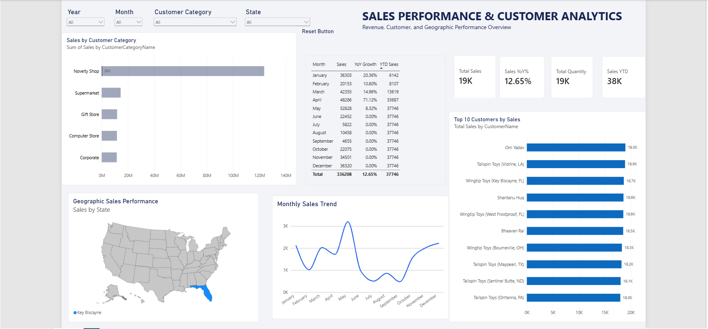

# Sales Performance & Customer Analytics Dashboard

## Project Overview

This project analyzes sales performance using Microsoft Power BI. 
The dashboard was designed to identify sales trends, customer performance,
geographic patterns, and year-over-year growth.

## Dashboard

## Tools Used

- Microsoft Power BI
- Power Query
- DAX
- Data Modeling
- Data Visualization

## Key Metrics

- Total Sales
- Total Quantity Sold
- Year-over-Year Growth
- YTD Sales
- Average Sales per Unit

## Dashboard Features

- Monthly sales trend analysis
- Sales by customer category
- Top customer analysis
- Geographic sales analysis
- Interactive filters
- Year-over-year performance tracking

## Key Insights

- Add your first finding here.
- Add your second finding here.
- Add your third finding here.

## Files

- `Sale Report Project.pbix` - Power BI dashboard file
- `Sales-Dashboard.png` - Dashboard preview
- Dataset - Source data used for the analysis
